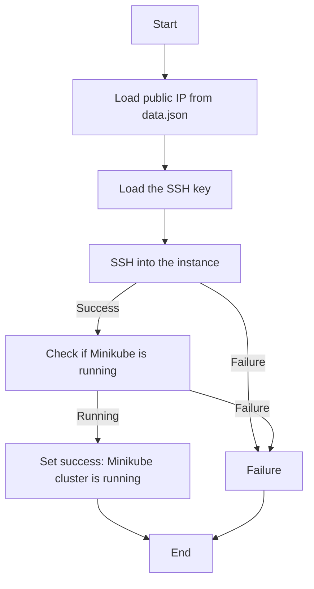

```mermaid
graph TD
    A[Start] --> B[Load public IP from data.json]
    B --> C[Load the SSH key]
    C --> D[SSH into the instance]
    D -->|Failure| E[Failure]
    D -->|Success| F[Check if Minikube is running]
    F -->|Running| G[Set success: Minikube cluster is running]
    F -->|Failure| E
    G --> H[End]
    E --> H
```
